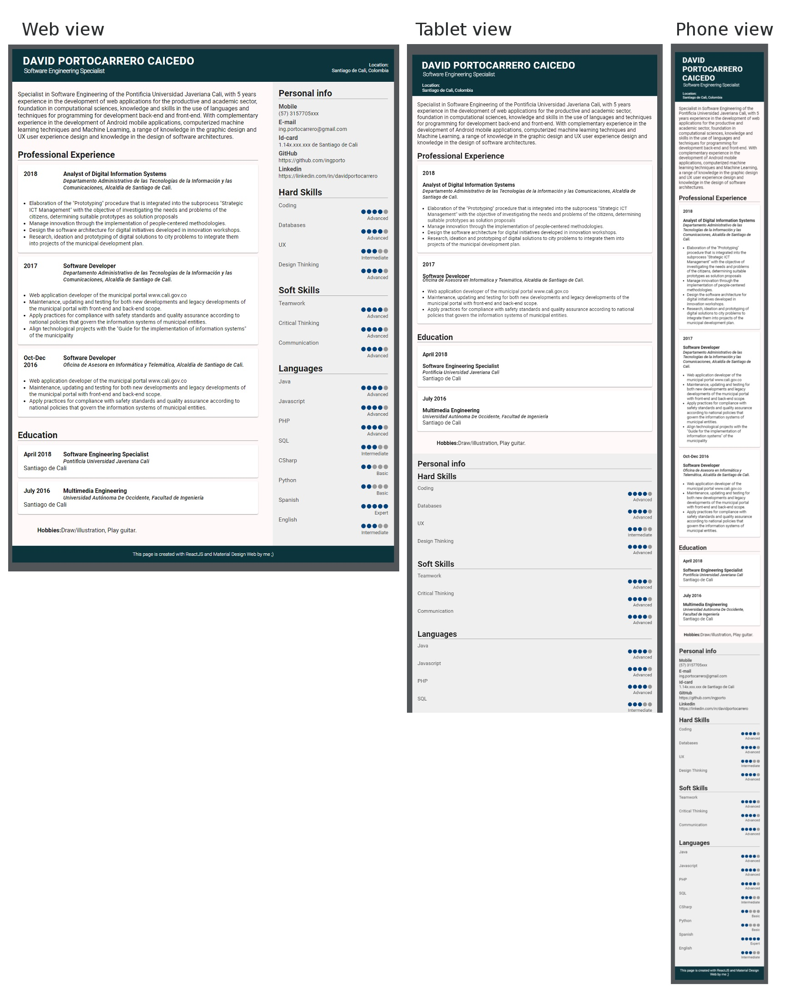

# Curriculum Vitae SPA with React [Still in development]
[](https://www.npmjs.com/package/react)   [](https://github.com/webpack/webpack/releases) 

Single Page Application describing my own professional resume.

## Installation

Clone the project
```
$ git clone https://github.com/IngPorto/react-curriculum-vitae.git
```
Change the directory
```
$ cd react-curriculum-vitae
```
Install the dependencies
```
$ npm install
```
Build the bundle with _Webpack_
```
$ npm run build:local
```

Now you can access to _dist/index.html_ 

## Global access

> [https://davidportocarrero.now.sh/](https://davidportocarrero.now.sh/)

### Screenshots



### Note: Bug fixed

Trying to install webpack from the [getting-started](https://webpack.js.org/guides/getting-started/) the console print out an Error message. To solve this, I had to run the next command:

```
$ npm i -D terser@3.14
```